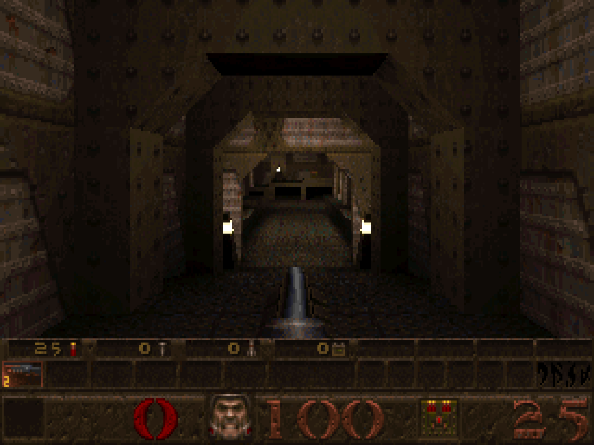
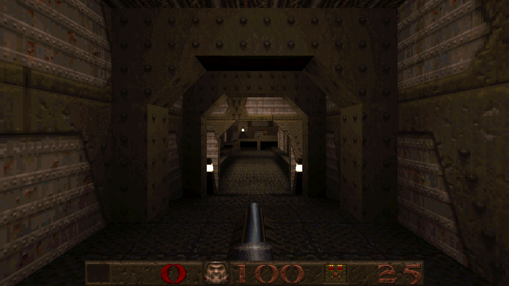

# quake-srp

*srp: slop rust port* — a dare: read the [Proof](#proof).

**Play it:** `DEMO-URL` (id's shareware episode, in the browser)

**Browsers:** tested in Chromium and Firefox (headless and headed) and on an Android phone; not
yet in Safari. Firefox has no Keyboard Lock, so there one Esc in fullscreen also leaves it. The
threads build needs the browser to give it its memory and its worker threads: if it will not,
the page says so and the game does not start (the single-threaded build is a deploy you choose,
not a fallback).

| Classic | slop (the default) |
|:---:|:---:|
|  |  |
| 320x200 in a 4:3 frame, id's status bar, id's 72 fps cap | the window's shape and size in whole pixels (here 960x540 shown at 2x), no frame-rate cap |

Both are stills from `quaketool shot`, so the slop crosshair isn't drawn. The slop one is
`quaketool shot quake-data/ID1/PAK0.PAK maps/e1m1.bsp out.ppm --res 960x540 --zoom 2 --video modern --scaled2d 1 --sbaroverlay 1`,
which draws the preset's values: Screen size 110 (no inventory bar) and perspective every 8 pixels.

id Software's *Quake* (1996), ported to Rust from the WinQuake C source, with only the
standard library and no `unsafe` code. With every extra switched off it is id's game,
checked against id's own C: every pixel but two in id's standard 3-D views, the sound
mixer sample for sample, and in demo playback the camera, every entity and every dynamic
light, frame by frame. What is known to differ still is a list
([AUDIT.md](AUDIT.md), "Open"). Every check is one command. By default it is the same software renderer given a 2026 machine. It plays
in a browser; natively, `quaketool` runs the same engine without a window.

**How it was built.** Claude, Anthropic's model, wrote the code and the docs in Claude
Code; the user set the rules, played it and reported what was wrong. Most of the work ran
as fleets of agents, each on its own git branch with a written brief, and a chair agent
that merged a branch only after the full check passed. The reference is id's own C,
compiled headless from the WinQuake source (the "oracle"), so a claim that the port
matches id is a comparison that anyone can re-run. The user's rules, in order: zero
dependencies, no `unsafe`, and Classic is id's game, proven for anything touched.
[STATUS.md](STATUS.md) keeps the history, round by round.

## What it is

- **A port of WinQuake's single-player game, file by file:**
  - the file formats and the QuakeC virtual machine;
  - the server's physics, monsters and combat;
  - the edge-sorted software renderer;
  - the status bar, the menus and the console;
  - the sound mixer.

  There is no multiplayer.
- **Checked against id's code.** id's C, built headless (the "oracle", in `oracle/`), is the
  reference. With every extra switched off, the port and id's C agree on:
  - 100.00% of pixels in the standard 3-D views (two pixels differ on one map);
  - the status bar, menus and console, apart from a few explained differences (the version
    string, the video-mode list, the port's own Options rows);
  - the mixer's output, sample for sample, on scripted cases;
  - demo playback, frame by frame: the camera, the entities and the dynamic lights (the
    game's state; a demo frame's pixels are compared on a sample of frames).

  One command re-runs all of it; see [Proof](#proof).
- **The slop options, and their preset.** They show what software-rendered Quake looks like
  when the hardware is no longer the limit:
  - native resolution in whole pixels, at any window shape, with a wider field of view;
  - no frame-rate cap: a new frame on every display refresh;
  - still 8-bit, with id's palette, colormaps and lighting, and textures are never
    filtered.
- **Plain Rust.** `#![forbid(unsafe_code)]` is on every crate and binary. That includes the
  browser build: an ordinary `fn main()` program (WASI) in a Web Worker, with no exports of
  its own, no bindings and no JavaScript toolchain.

## Build and run it

The commands are for a POSIX shell (`sh`, `bash`, `zsh`), run from the repository's root.
You need:
- Rust 1.85 or later, with the `wasm32-wasip1-threads` target;
- `uv`;
- `curl`, `unzip` and `bsdtar` (Debian's `libarchive-tools`);
- a static file server that can send headers. The examples use `miniserve`.

**1. The data.** The repo has none. Fetch id's freely redistributable shareware pak:

```sh
curl -sL -o quake106.zip https://raw.githubusercontent.com/Jason2Brownlee/QuakeOfficialArchive/main/bin/quake106.zip
unzip quake106.zip resource.1 && bsdtar -xf resource.1 ID1/PAK0.PAK   # the zip holds an LZH archive
mkdir -p quake-data && mv ID1 quake-data/ && rm quake106.zip resource.1
```

`ci/fetch_shareware.sh` does the same and checks both files' hashes.

**2. Build and assemble** a directory with the page, the program and the pak:

```sh
rustup target add wasm32-wasip1-threads
(cd quake-wasm && cargo build --release --target wasm32-wasip1-threads)
D=$HOME/quake-web
(cd web && uv run python -c "import isolated; isolated.copy_page('$D')")
cp quake-wasm/target/wasm32-wasip1-threads/release/quake.wasm "$D/"
mkdir -p "$D/id1" && cp quake-data/ID1/PAK0.PAK "$D/id1/pak0.pak"
```

The target `wasm32-wasip1` builds a single-threaded program instead. It runs in the same
page and needs less memory: add that target and copy its `quake.wasm` from
`target/wasm32-wasip1/release/`.

**3. Serve it** with two headers, and open `http://localhost:8080/`:

```sh
miniserve -p 8080 --index index.html \
  --header "Cross-Origin-Opener-Policy:same-origin" \
  --header "Cross-Origin-Embedder-Policy:require-corp" "$D"
```

The game uses shared memory, which browsers allow only on a *cross-origin isolated* page.
That needs those two headers and a secure context: `https://`, or `localhost`. To play from
another device, put the server behind anything that serves https. If a host can't send the
headers, the page's service worker adds them after one reload.

**A public demo:** `web/publish.sh DIR` builds the threads program and assembles `DIR`
with the page, the program and the shareware pak (with id's licence beside it), and a
`_headers` file that Cloudflare Pages and Netlify read for the two headers and the
caching. Upload `DIR` as it is.

You play with WASD and the mouse (click the game to capture the mouse), in either preset:

| key or input | does |
|---|---|
| Space | jump, or swim up |
| C | swim down |
| click | fire |
| 1–8 | choose a weapon |
| Esc | the menu |
| `~` | the console |
| Alt+Enter | fullscreen (and the bar's button, or the browser's F11); in fullscreen Esc is the menu, hold Esc to leave |
| F6 / F9 | quicksave / quickload (id's F-keys: F1 help, F2/F3 save/load, F4 options, F10 quit) |

A gamepad or a touch screen also works (a phone plays sideways only: held upright, a "turn your
phone sideways" screen covers the page and the game waits behind it). The mouse wheel switches weapons in slop only (id's
`default.cfg` leaves it unbound). The page's **keys** button lists them all. For id's own
1996 controls (the arrows, no mouse look, no gamepad, Always Run off) type `idcontrols` in
the console.

**If the mouse feels slow on a Mac:** macOS 26 hands a browser one mouse move per screen
refresh, and of a fast mouse's reports in between only one seems to count, so a 1000 Hz
gaming mouse turns about an eighth as far on a 120 Hz screen and a sixteenth on a 60 Hz
one (Chrome and Safari alike). Raise **Options > Mouse Speed** (`sensitivity 20` in the
console goes past the slider's end), or set the mouse to poll at 125 Hz, which also keeps
the fine aim. The numbers are in [web/PLATFORM.md](web/PLATFORM.md#input), "The mouse
against the trackpad".

## The slop options and the Classic preset

Every difference from id's game is a named setting, one of the port's "slop options" (its
name: quake-srp, the slop rust port). Two fixed presets set them: **slop**, the default,
turns most of them on; **Classic** turns them off. The controls are the same in both.

| | Classic | slop |
|---|---|---|
| frame rate | id's 72 fps cap | a frame every display refresh (Frame rate cap: none, or 60 to 240 frames drawn a second, the game still every refresh); jumps, lifts, flashes and trails are stepped to match 72 Hz, within the tolerances [FRAMERATE.md](FRAMERATE.md) states |
| picture | a fixed mode (960x600 by default) in a 4:3 frame, id's 90° field of view | the window's own size and shape in whole pixels (1x, 2x on a touch screen; Video Options lists 1x to 4x with the size each gives), a wider view on wide screens |
| status bar, menus, console | 1:1, as id drew them; Screen size 100: the status bar with the inventory bar above it | scaled up by a whole number; Screen size starts one step larger, 110: the status bar without the inventory bar, so the HUD takes less of the screen |
| monsters | move in id's 0.1 s steps, and change pose ten times a second | glide between the steps, and blend between poses (the gun too) |
| lights | the flickering ones snap ten times a second; most torches and flames steady, as the map baked them | the flickering ones glide; the steady torches and flames flicker gently about their light (`r_torchflicker`, a strength) |
| controls | WASD, mouse look, Always Run, a twin-stick gamepad with rumble, touch controls (the same in both; `idcontrols` is id's `default.cfg`) | the same, plus the mouse wheel for weapons and a crosshair |
| sound | id's mixer at 11025 Hz | id's mixer at the device's rate, with four of id's bugs fixed |
| perspective | id's spans: exact every 16 pixels, affine in between | exact every 8 pixels along walls and liquids, id's own portable-C loop (Perspective span, `r_perspspan`: 64, 32, 16, 8, 4 or exact at every pixel; 32 on a phone and 64 at 1080p are about what 1996 looked like) |

The numbers the machine decides are picked once, at start, and shown as numbers, never
"auto": on a touch screen the game starts at 2x on four threads; elsewhere at 1x on every
thread. Neither caps the frame rate. A frame never gets bigger than the
browser build's memory holds: past it, the next pixel size (5K and 8K screens draw at 2x).
In both presets the renderer splits each frame across the CPU cores (`r_threads`), and the
picture is the same on any number of them.

**Options** (id's screen; the port's three rows last, after Video Options, where id's
"Reset to defaults" row is gone): **Slop Options** opens the settings, one page each for
**Picture and sound**, **Motion and light** (the torches' flicker is there) and **Controls**,
where every setting can be changed alone; the picture's size is chosen in Video Options.
**Reset to Classic** and **Reset to slop** set everything to that preset — keys, Options
(Screen size, Brightness, the volumes, the mouse), the video mode, every setting — after
asking; your saved games stay. The menus do not say where your settings stand or mark what
differs from a preset; the console's `preset` does, by name. The console's `preset slop` or
`preset classic` is the gentler switch: it sets the port's settings to the preset's and
keeps your keys and Options; the address's `?classic` or `?slop` does the same at a load,
when your settings were last set to the other one, so a bookmarked `?classic` keeps what you
change on top of it. `config.cfg`, in the browser's storage, keeps the preset and only what
you changed from it.
[AUDIT.md](AUDIT.md) ("The slop options and the presets") lists every setting and why it
exists. The oracle compares Classic with id's 1996 keys too (`idcontrols`).

In either preset the page can be installed as an app, and it works offline. It also
plays the registered game and the mission packs from your own copies
([PLATFORM.md](web/PLATFORM.md), "Your files").

## How it works

```
 the page (web/)                          the program (quake.wasm, in a Web Worker)
 ───────────────                          ─────────────────────────────────────────
 keys, mouse, pad, touch  ── stdin ───▶   fn main(): wait for a tick, run one frame
 WebGL2 canvas            ◀── shared ──   8-bit pixels and a 256-colour palette
 AudioWorklet             ◀── shared ──   16-bit PCM from id's mixer, in a ring
 pak via HTTP, IndexedDB  ◀── WASI ───▶   std::fs: pak0.pak, s0.sav, config.cfg
```

Events go in on stdin. Frames and sound come back through memory that the page and the
worker share.

- **The engine is a library.** [`quake-rs`](quake-rs/README.md) holds the game's systems.
  Each frame it takes the player's input and returns three things: an 8-bit image, the
  frame's colour shifts for its palette, and sound calls. A host adds the frame loop,
  input routing, the files, the screen and the speakers. `quake-wasm` is the browser's
  host; `quaketool` drives the same frames natively.
- **The browser build is a normal program.** `quake-wasm` has a `main` loop that reads
  events from stdin and writes records to stdout. `web/wasi.js` is a small WASI host. It
  lets the worker block between frames on `Atomics.wait`, and it serves the program's
  files: the pak it fetched, plus the saves and `config.cfg` that the page keeps in
  IndexedDB. Saves and the config are real files, written the way the C wrote them.
- **The frame stays 8-bit to the end.** The page uploads the palette indices, and a shader
  looks each one up in the frame's 256-colour palette, like a VGA DAC. A 2-D canvas is the
  fallback.
- **Every core, the same picture.** After id's BSP walk and edge scan, which run on one
  thread, the view is cut into row bands. Each band goes through id's drawing passes in
  id's order on its own thread, so every thread count gives the same frame.
- **id's mixer, not the browser's.** The engine paints PCM with `snd_mix.c`'s code into a
  ring it shares with an AudioWorklet.

[web/PLATFORM.md](web/PLATFORM.md) covers the protocol, shared memory, threads, sound,
input, touch and offline play in detail.

## Proof

```sh
uv run oracle/classic_check.py      # about a minute once built; prints ALL PASS
```

This runs the Classic preset through nine checks. Four compare the port with values
recorded from a tree known to be right. Five run id's C next to the port:

| check | compares | against |
|---|---|---|
| `goldens` | three reference renders (by hash) | recorded |
| `play` | the browser's client run natively on id's demos and scripted walks (frame hashes) | recorded |
| `timedemo` | id's benchmark: the frame counts | recorded |
| `census` | a headless playthrough of all nine maps | recorded |
| `edicts` | the entities' fields against id's server on all nine maps (the known differences, such as the player's edict number and random numbers, are recorded) | id's C |
| `oracle` | the 3-D view, pixel by pixel | id's C |
| `screen2d` | the status bar, menus and console | id's C |
| `demolerp` | demo playback, frame by frame | id's C |
| `sound` | the mixer, sample by sample | id's C |

The id's-C checks need id's WinQuake source ([id-Software/Quake](https://github.com/id-Software/Quake))
and docker to build the oracle once. Put the source at `quake-c/` (so that
`quake-c/WinQuake` exists), or point `QUAKE_C_SRC` at its `WinQuake` directory.
[oracle/README.md](oracle/README.md) has every result and explains each remaining
difference.

Beyond Classic:
- `cargo test` passes in both crates, and clippy shows zero warnings. CI runs both, and
  both browser builds, on every push (`.github/workflows/check.yml`; `ci/local.sh` runs
  the same commands on a checkout).
- `quake-rs/target/release/quaketool framerate quake-data/ID1/PAK0.PAK --check` runs
  gameplay scenarios at high frame rates and compares them with id's 72 Hz, each within a
  stated tolerance ([FRAMERATE.md](FRAMERATE.md)).
- The headless-browser checks (`web/verify_*.py`) cover everything from walking and the
  menus to the gamepad, touch, quitting, sound through late frames, how a refresh waits
  for its frame, and reading back the canvas. All pass in Chromium and in Firefox (`QUAKE_BROWSER=firefox`; Firefox's touch
  check runs on taps, and the Keyboard Lock checks are skipped there: `web/PLATFORM.md`,
  "Build, serve, deploy").

## The repository

| path | what |
|---|---|
| [`quake-rs/`](quake-rs/README.md) | the engine, its tests, and `quaketool` |
| `quake-wasm/` | the browser program: the WASI `main` loop, its protocol, and end-to-end tests against the real pak |
| `web/` | the page, the WASI host (`wasi.js`), touch controls, the service worker, the browser checks |
| `oracle/` | id's WinQuake built headless from the C, and the scripts that compare it with the port |
| `census/` | helpers for the gameplay census ([CENSUS.md](CENSUS.md)) |
| `screenshots/` | the two renders at the top of this README |
| `ci/`, `.github/workflows/` | the checks CI runs (`ci/local.sh` runs them here), and the shareware pak's fetch |

Further reading:

| file | what it covers |
|---|---|
| [STATUS.md](STATUS.md) | where things stand, what isn't verified, what's next, and the history |
| [AUDIT.md](AUDIT.md) | every difference from id's game found so far, with evidence |
| [CODE_PLAN.md](CODE_PLAN.md) | the code-quality plan: done, and next |
| [PERF_PLAN.md](PERF_PLAN.md) | performance work, measured |

## License

GPL-2.0-or-later; the text is in [LICENSE](LICENSE). The port is derived from the Quake
source that id Software released under the GPL (© 1996–1997 id Software, Inc.); the port's
own code is © 2026 its authors, under the same licence.

No game data is in this repository. The shareware data that a demo serves (`id1/pak0.pak`)
is id's, unmodified, under id's own terms: the shareware licence (`SLICNSE.TXT` in
`quake106.zip`), whose section 6, "Permitted Distribution", grants "the limited right to
distribute, free of charge only, the Software as a whole". The registered game and the
mission packs are not redistributable; the port plays them only from a player's own
copies.
